# EdForge Architecture Documentation Update

## Phase 1: Technical Status Report

Create a new file `edforge-mfe/docs/TECHNICAL_STATUS_REPORT.md` documenting:

### 1.1 Current Implementation Status

**Presentation Layer Summary:**

- **Shell Application** (port 3000): Fully implemented with ABAC, multi-tenant context, theme system, and dynamic sidebar navigation
- **7 Remote MFEs**: Academics (3002), Finance (3003), Ed-Fi (3001), Special Programs (3005), People (3006), Messages (3007), Analytics (3008)
- **8 Shared Packages**: types, abac, ui, theme, forms, wizard, config, shell-components

**Navigation Consolidation Completed:**| Module | Before | After | Pattern ||--------|--------|-------|---------|| Academics | 15 items | 6 items | Students, Attendance, Grades, Scheduling, Curriculum || Finance | 12 items | 4 items | Ledger, Billing, Expenses || People | 10 items | 3 items | Staff Directory, HR Admin || Settings | Mixed | Grouped | ACCOUNT (5) + WORKSPACE (6) + Danger Zone |**Role-Based Navigation:**

- Admin/Educator Home → Full module access
- Student Home → My Grades, Attendance, Schedule, Assignments
- Parent Home → Children overview, Grades, Fees, Communications

### 1.2 Routes Implemented Per Module

```javascript
Shell (router.tsx)
├── /login
├── /home
├── /settings/* (13 sub-routes)
├── /academics/* → Remote
├── /finance/* → Remote
├── /people/* → Remote
├── /messages/* → Remote
├── /analytics/* → Remote
├── /edfi/* → Remote
├── /special-programs/* → Remote
├── /student-portal (placeholder)
└── /parent-portal (placeholder)

Academics Remote
├── /students, /attendance, /grades, /scheduling, /curriculum
└── Legacy: /gradebooks, /assessments, /exams, /classrooms, etc.

Finance Remote
├── /ledger, /billing, /expenses
└── /payroll, /tuition

Ed-Fi Remote
├── / (Sync Dashboard)
├── /connections, /mapping, /errors

Special Programs Remote
├── /ieps, /ieps/meetings, /ieps/goals
├── /504-plans, /accommodations, /accessibility
└── /counseling, /interventions

Analytics Remote
├── /enrollment, /attendance, /performance, /finance
└── /comparisons, /custom
```

---

## Phase 2: Updated Architecture Knowledge Kit (v2.0)

Update [`edforge-mfe/docs/ARCHITECTURE_KNOWLEDGE_KIT.md`](edforge-mfe/docs/ARCHITECTURE_KNOWLEDGE_KIT.md) with:

### 2.1 Updated Module Federation Diagram

```mermaid
graph TB
    subgraph shell [Shell Application :3000]
        Router[TanStack Router]
        ABAC[ABAC Engine]
        TenantCtx[Tenant Context]
        ThemeStore[Theme Store]
    end

    subgraph remotes [Remote MFEs]
        Academics[academics :3002]
        Finance[finance :3003]
        EdFi[edfi :3001]
        SpecialProgs[special-programs :3005]
        People[people :3006]
        Messages[messages :3007]
        Analytics[analytics :3008]
    end

    subgraph packages [Shared Packages]
        Types[@edforge/types]
        AbacPkg[@edforge/abac]
        UI[@edforge/ui]
        Theme[@edforge/theme]
        Forms[@edforge/forms]
    end

    shell --> remotes
    remotes --> packages
    shell --> packages
```


### 2.2 Revised Backend Service Recommendations

**AWS ECS Cluster (Always-On Services):**| Service | Entities | Justification ||---------|----------|---------------|| `identity-service` | User, Session, Token | Sub-second auth response required || `academics-service` | Student, Enrollment, Attendance, Grade | High-frequency CRUD operations |**AWS Lambda (Event-Driven Services):**| Service | Entities | Trigger Pattern ||---------|----------|-----------------|| `tenant-service` | Tenant, School, SchoolYear, Term | API Gateway + caching || `finance-service` | Invoice, Payment, Fee, Expense, Transaction | API Gateway + SQS for batch || `hr-service` | Employee, Contract, Payroll, ProfDev | Scheduled + API Gateway || `communications-service` | Message, Announcement, Notification | SNS/SES + API Gateway || `analytics-service` | Report, Dashboard, DataExport | S3 trigger + API Gateway || `special-programs-service` | IEP, 504Plan, Accommodation, Intervention | API Gateway || `edfi-integration-service` | EdFiConnection, SyncJob, SyncError | Step Functions + EventBridge |

### 2.3 Service Grouping Strategy (Cost-Optimized)

```mermaid
flowchart LR
    subgraph ecs [ECS Cluster - Always On]
        identity[identity-service]
        academics[academics-service]
    end

    subgraph lambda_high [Lambda - High Frequency]
        tenant[tenant-service]
        finance[finance-service]
    end

    subgraph lambda_low [Lambda - Low Frequency]
        hr[hr-service]
        special[special-programs-service]
        comms[communications-service]
    end

    subgraph lambda_async [Lambda - Async/Batch]
        analytics[analytics-service]
        edfi[edfi-integration-service]
    end

    ecs --> lambda_high
    lambda_high --> lambda_low
    lambda_low --> lambda_async
```




### 2.4 Updated ABAC Resource Matrix

Document the 50+ resources defined in [`packages/abac/src/permissions.ts`](edforge-mfe/packages/abac/src/permissions.ts) organized by domain.

### 2.5 API Design Patterns

Update REST endpoint patterns to match the consolidated frontend routes:

```javascript
# Academics
GET/POST   /api/academics/students
GET/PATCH  /api/academics/students/:id
POST       /api/academics/attendance/bulk
GET        /api/academics/grades?studentId=&termId=

# Finance (consolidated)
GET        /api/finance/ledger?type=gl|ap|ar
POST       /api/finance/billing/invoices
GET        /api/finance/expenses?status=pending|approved

# HR (consolidated)
GET        /api/hr/staff?department=&status=
GET        /api/hr/admin/payroll?period=
GET        /api/hr/admin/contracts?employeeId=

# Ed-Fi Integration
POST       /api/edfi/connections
POST       /api/edfi/sync/start
GET        /api/edfi/sync/:jobId/status
GET        /api/edfi/errors?severity=critical|warning
```


### 2.6 Multi-Tenancy Implementation Guide

Detail the tenant resolution flow:

1. URL subdomain extraction → `{tenant}.edforge.io`
2. Tenant context injection via headers
3. Database query scoping with `tenantId`
4. School context switching for cross-school users

### 2.7 Environment Configuration

| App | Port | Module Federation Name ||-----|------|------------------------|| Shell | 3000 | shell || Ed-Fi | 3001 | edfi || Academics | 3002 | academics || Finance | 3003 | finance || Special Programs | 3005 | special_programs || People | 3006 | people || Messages | 3007 | messages || Analytics | 3008 | analytics |---

## Deliverables

1. **TECHNICAL_STATUS_REPORT.md** - Current implementation status
2. **ARCHITECTURE_KNOWLEDGE_KIT.md v2.0** - Updated with: