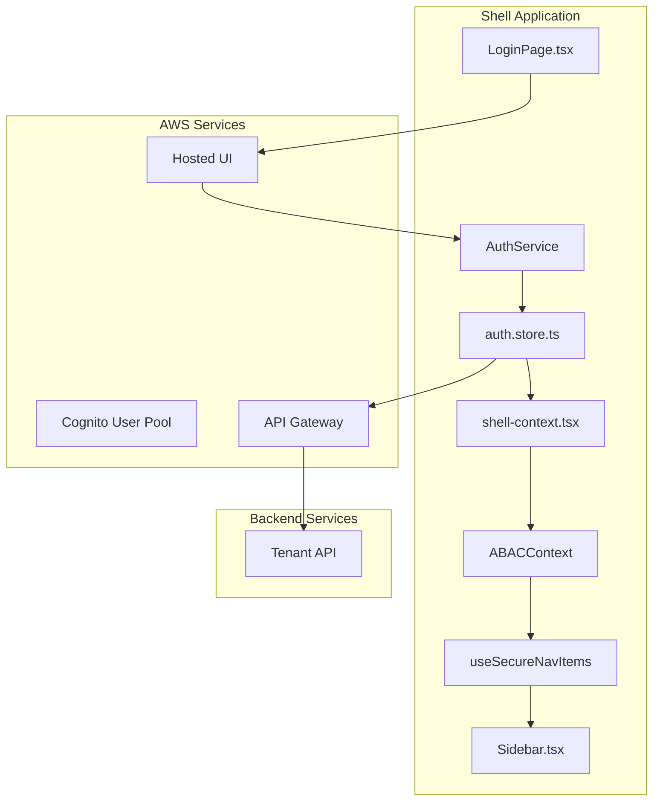
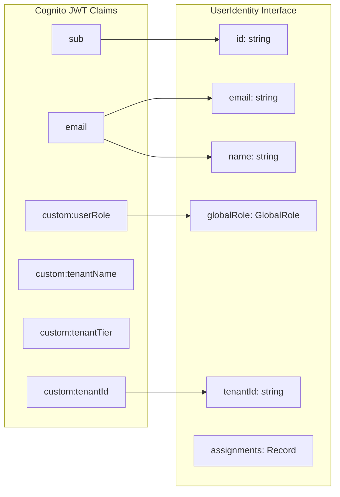
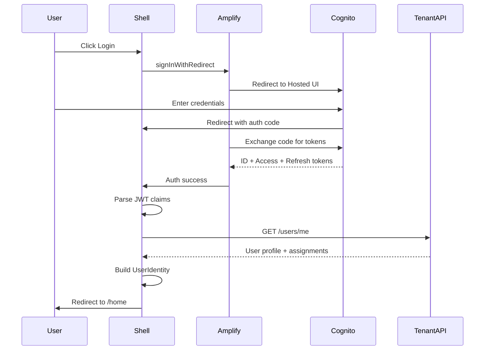
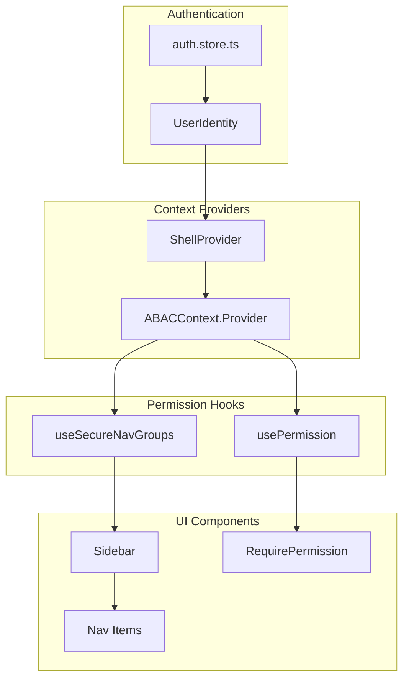

# EdForge AWS Cognito + Backend Integration Plan

## Architecture Overview



---

## Cognito to ABAC Mapping

Your Cognito user attributes map directly to the existing `UserIdentity` interface:



**Critical Mapping:**| Cognito Attribute | UserIdentity Field | ABAC Usage ||-------------------|-------------------|------------|| `sub` | `id` | User identifier || `email` | `email` | Display & notifications || `custom:tenantId` | `tenantId` | Multi-tenant isolation || `custom:userRole` | `globalRole` | TenantAdmin bypass in ABAC engine || API Response | `assignments` | School-level permission checks |---

## Phase 1: Authentication Foundation

### 1.1 Create Auth Package

Create `packages/auth/` with the following structure:

```javascript
packages/auth/
├── src/
│   ├── index.ts           # Public exports
│   ├── config.ts          # Amplify configuration
│   ├── service.ts         # Auth service (login, logout, refresh)
│   ├── user-mapper.ts     # Map Cognito attributes to UserIdentity
│   └── types.ts           # Auth-specific types
├── package.json
└── tsconfig.json
```

**Key Implementation - User Mapper:**

```typescript
// packages/auth/src/user-mapper.ts
import type { UserIdentity, GlobalRole, SchoolRole } from '@edforge/types'

interface CognitoIdTokenPayload {
  sub: string
  email: string
  name?: string
  'custom:tenantId': string
  'custom:tenantName': string
  'custom:tenantTier': string
  'custom:userRole': string  // "TenantAdmin" or "StandardUser"
}

export function mapCognitoToUserIdentity(
  payload: CognitoIdTokenPayload,
  schoolAssignments: Array<{ schoolId: string; role: SchoolRole }>
): UserIdentity {
  return {
    id: payload.sub,
    email: payload.email,
    name: payload.name ?? payload.email.split('@')[0],
    globalRole: payload['custom:userRole'] as GlobalRole,
    tenantId: payload['custom:tenantId'],
    assignments: schoolAssignments.reduce((acc, { schoolId, role }) => {
      acc[schoolId] = role
      return acc
    }, {} as Record<string, SchoolRole>),
  }
}
```


### 1.2 Environment Configuration

Create `.env.local` for each app:

```env
# apps/shell/.env.local
VITE_COGNITO_USER_POOL_ID=us-east-1_Mj1Vk6TSJfXW
VITE_COGNITO_CLIENT_ID=<your-client-id>
VITE_COGNITO_DOMAIN=edforge.auth.us-east-1.amazoncognito.com
VITE_COGNITO_REGION=us-east-1
VITE_API_URL=https://jnz80b5ra4.execute-api.us-east-1.amazonaws.com/prod
VITE_REDIRECT_URI=http://localhost:3000
```


### 1.3 Amplify Configuration

```typescript
// packages/auth/src/config.ts
import { Amplify } from 'aws-amplify'

export function configureAmplify() {
  Amplify.configure({
    Auth: {
      Cognito: {
        userPoolId: import.meta.env.VITE_COGNITO_USER_POOL_ID,
        userPoolClientId: import.meta.env.VITE_COGNITO_CLIENT_ID,
        loginWith: {
          oauth: {
            domain: import.meta.env.VITE_COGNITO_DOMAIN,
            scopes: ['openid', 'email', 'profile'],
            redirectSignIn: [import.meta.env.VITE_REDIRECT_URI],
            redirectSignOut: [import.meta.env.VITE_REDIRECT_URI],
            responseType: 'code',
          },
        },
      },
    },
  })
}
```

---

## Phase 2: Login Flow

### 2.1 OAuth2/PKCE Flow




### 2.2 Update Login Page

Transform `LoginPage.tsx` from mock user selection to Cognito redirect:

```typescript
// apps/shell/src/components/layout/LoginPage.tsx
import { signInWithRedirect } from 'aws-amplify/auth'

export function LoginPage() {
  const [isLoading, setIsLoading] = useState(false)

  const handleLogin = async () => {
    setIsLoading(true)
    try {
      await signInWithRedirect()
    } catch (error) {
      console.error('Login failed:', error)
      setIsLoading(false)
    }
  }

  return (
    <div className="min-h-screen bg-gradient-to-br from-teal-900 via-ink-500 to-cyan-900 flex items-center justify-center p-6">
      {/* Branded login UI */}
      <Card glass>
        <CardContent className="p-8">
          <h1 className="text-2xl font-bold text-text-primary mb-2">
            Welcome to EdForge
          </h1>
          <p className="text-text-secondary mb-6">
            Sign in to access your education management system
          </p>
          <Button onClick={handleLogin} disabled={isLoading} className="w-full" size="lg">
            {isLoading ? 'Redirecting...' : 'Sign In with EdForge'}
          </Button>
        </CardContent>
      </Card>
    </div>
  )
}
```


### 2.3 Auth Store Refactor

Replace mock data in `auth.store.ts`:

```typescript
// apps/shell/src/stores/auth.store.ts
import { create } from 'zustand'
import { persist } from 'zustand/middleware'
import { fetchAuthSession, signOut, getCurrentUser } from 'aws-amplify/auth'
import type { UserIdentity, SchoolRole } from '@edforge/types'
import { mapCognitoToUserIdentity } from '@edforge/auth'
import { tenantService } from '../services/tenant.service'

interface AuthStore {
  user: UserIdentity | null
  isAuthenticated: boolean
  isLoading: boolean
  
  // Actions
  initializeAuth: () => Promise<void>
  logout: () => Promise<void>
  
  // Helpers
  getUserSchools: () => string[]
  getUserRoleInSchool: (schoolId: string) => SchoolRole | null
}

export const useAuthStore = create<AuthStore>()(
  persist(
    (set, get) => ({
      user: null,
      isAuthenticated: false,
      isLoading: true,

      initializeAuth: async () => {
        try {
          set({ isLoading: true })
          
          // Check if user is authenticated with Cognito
          const session = await fetchAuthSession()
          if (!session.tokens?.idToken) {
            set({ user: null, isAuthenticated: false, isLoading: false })
            return
          }

          // Parse JWT claims
          const payload = session.tokens.idToken.payload as CognitoIdTokenPayload
          
          // Fetch school assignments from Tenant API
          const userProfile = await tenantService.getCurrentUser()
          
          // Build UserIdentity
          const user = mapCognitoToUserIdentity(payload, userProfile.assignments)
          
          set({ user, isAuthenticated: true, isLoading: false })
        } catch (error) {
          console.error('Auth initialization failed:', error)
          set({ user: null, isAuthenticated: false, isLoading: false })
        }
      },

      logout: async () => {
        await signOut()
        set({ user: null, isAuthenticated: false })
      },

      getUserSchools: () => {
        const { user } = get()
        return user ? Object.keys(user.assignments) : []
      },

      getUserRoleInSchool: (schoolId) => {
        const { user } = get()
        return user?.assignments[schoolId] ?? null
      },
    }),
    {
      name: 'edforge-auth',
      partialize: (state) => ({ 
        user: state.user, 
        isAuthenticated: state.isAuthenticated 
      }),
    }
  )
)
```

---

## Phase 3: ABAC Integration with Components

### 3.1 How ABAC Currently Works

The existing ABAC system uses these key components:

1. **ABAC Engine** (`packages/abac/src/engine.ts`):

- `can(user, { action, resource, schoolId })` - Core permission check
- TenantAdmin bypasses all school-level checks

2. **ABAC Hooks** (`packages/abac/src/hooks.ts`):

- `usePermission(action, resource)` - Check single permission
- `useCanAccess(resource)` - Check view permission

3. **Secure Components** (`apps/shell/src/components/secure/`):

- `RequirePermission` - Conditional rendering wrapper
- `withPermission` - HOC for route protection

4. **Navigation Filtering** (`apps/shell/src/hooks/useSecureNavItems.ts`):

- `useSecureNavItems` - Filters nav items by permission
- `useSecureNavGroups` - Filters entire navigation groups

### 3.2 ABAC Context Flow




### 3.3 Update Shell Context

Modify `shell-context.tsx` to fetch real data:

```typescript
// apps/shell/src/lib/shell-context.tsx
export function ShellProvider({ children }: { children: ReactNode }) {
  const user = useAuthStore((s) => s.user)
  const isAuthenticated = useAuthStore((s) => s.isAuthenticated)
  const isLoading = useAuthStore((s) => s.isLoading)
  const initializeAuth = useAuthStore((s) => s.initializeAuth)
  const logout = useAuthStore((s) => s.logout)
  
  const { activeSchoolId, setActiveSchoolId } = useAppStore()
  
  // Fetch tenant and schools from API
  const { data: tenant } = useQuery({
    queryKey: ['tenant', user?.tenantId],
    queryFn: () => tenantService.getTenant(user!.tenantId),
    enabled: !!user?.tenantId,
  })
  
  const { data: schools } = useQuery({
    queryKey: ['schools', user?.tenantId],
    queryFn: () => tenantService.getSchools(user!.tenantId),
    enabled: !!user?.tenantId,
  })
  
  // Initialize auth on mount
  useEffect(() => {
    initializeAuth()
  }, [initializeAuth])
  
  // Filter schools user has access to
  const availableSchools = useMemo(() => {
    if (!user || !schools) return []
    const assignedSchoolIds = Object.keys(user.assignments)
    return schools.filter((s) => assignedSchoolIds.includes(s.id))
  }, [user, schools])

  // ABAC context value - this feeds into all permission hooks
  const abacValue: ABACContextValue = useMemo(
    () => ({
      user,
      activeSchoolId,
    }),
    [user, activeSchoolId]
  )

  if (isLoading) {
    return <LoadingScreen message="Authenticating..." />
  }

  return (
    <ShellContext.Provider value={shellValue}>
      <ABACContext.Provider value={abacValue}>
        {children}
      </ABACContext.Provider>
    </ShellContext.Provider>
  )
}
```


### 3.4 TenantAdmin Full Access

When `custom:userRole = TenantAdmin`, the ABAC engine grants full access:

```typescript
// packages/abac/src/engine.ts - Line 37-39
export function can(user: UserIdentity | null, context: PermissionContext): boolean {
  if (!user) return false
  
  // TenantAdmin has full access to everything
  if (user.globalRole === 'TenantAdmin') {
    return true  // <-- Your milo user bypasses all permission checks
  }
  
  // StandardUsers need school-level permission checks...
}
```

This means your `rainshoaib01@gmail.com` user with `custom:userRole = TenantAdmin` will:

- See ALL navigation items in the sidebar
- Access ALL routes without restrictions
- Have full CRUD on all resources

---

## Phase 4: API Client Integration

### 4.1 Update API Client

```typescript
// apps/shell/src/lib/api.ts
import axios from 'axios'
import { fetchAuthSession } from 'aws-amplify/auth'

const api = axios.create({
  baseURL: import.meta.env.VITE_API_URL,
  timeout: 30000,
})

api.interceptors.request.use(async (config) => {
  try {
    const session = await fetchAuthSession()
    const token = session.tokens?.idToken?.toString()
    
    if (token) {
      config.headers.Authorization = `Bearer ${token}`
    }
  } catch (error) {
    // Not authenticated - let request proceed without token
    // Backend will return 401
  }
  
  return config
})

api.interceptors.response.use(
  (response) => response,
  async (error) => {
    if (error.response?.status === 401) {
      // Token expired or invalid - redirect to login
      window.location.href = '/login'
    }
    return Promise.reject(error)
  }
)

export { api }
```


### 4.2 Tenant Service

```typescript
// apps/shell/src/services/tenant.service.ts
import { api } from '../lib/api'
import type { Tenant, School } from '@edforge/types'

interface UserProfile {
  id: string
  email: string
  assignments: Array<{ schoolId: string; role: string }>
}

export const tenantService = {
  getCurrentUser: async (): Promise<UserProfile> => {
    const { data } = await api.get('/users/me')
    return data
  },
  
  getTenant: async (tenantId: string): Promise<Tenant> => {
    const { data } = await api.get(`/tenants/${tenantId}`)
    return data
  },
  
  getSchools: async (tenantId: string): Promise<School[]> => {
    const { data } = await api.get(`/tenants/${tenantId}/schools`)
    return data
  },
}
```

---

## Phase 5: Testing with Milo Tenant

### 5.1 Test Scenarios

| Test Case | Action | Expected Result ||-----------|--------|-----------------|| TenantAdmin Login | Login as rainshoaib01@gmail.com | Full sidebar visible, all modules accessible || ABAC Bypass | Navigate to any route | Access granted (TenantAdmin = true) || School Selector | Click school dropdown | Shows schools from tenant API || API Authorization | View /academics/students | Request includes valid JWT, data returned || Token Refresh | Wait for token expiry | Amplify auto-refreshes, no interruption || Logout | Click logout | Redirect to Cognito logout, clear session |

### 5.2 Verification Steps

1. Start the shell: `pnpm dev:shell`
2. Navigate to `http://localhost:3000`
3. Click "Sign In" - redirects to Cognito Hosted UI
4. Enter `rainshoaib01@gmail.com` credentials
5. Verify redirect back to `/home`
6. Check DevTools Network tab for API calls with Bearer token
7. Verify sidebar shows all modules (TenantAdmin access)
8. Test school selector dropdown
9. Navigate to `/academics/students` - should load real data

---

## Files Summary

### New Files to Create

| File | Purpose ||------|---------|| `packages/auth/src/index.ts` | Package entry point || `packages/auth/src/config.ts` | Amplify configuration || `packages/auth/src/service.ts` | Auth operations || `packages/auth/src/user-mapper.ts` | Cognito to UserIdentity mapper || `packages/auth/package.json` | Package manifest || `apps/shell/.env.local` | Environment variables || `apps/shell/src/services/tenant.service.ts` | Tenant API client |

### Files to Modify

| File | Changes ||------|---------|| `apps/shell/src/stores/auth.store.ts` | Remove MOCK_USERS, add Amplify integration || `apps/shell/src/lib/shell-context.tsx` | Fetch real tenant/schools from API || `apps/shell/src/components/layout/LoginPage.tsx` | Cognito redirect instead of mock selection || `apps/shell/src/lib/api.ts` | Use Amplify for JWT injection || `apps/shell/src/main.tsx` | Initialize Amplify on app load || `apps/shell/rsbuild.config.ts` | Pass through VITE_ env variables |---

## Implementation Order

1. **env-setup**: Create `.env.local` files with your Cognito credentials
2. **auth-package**: Create `@edforge/auth` package with Amplify config
3. **auth-store**: Refactor `auth.store.ts` to use Amplify
4. **login-page**: Update `LoginPage.tsx` for Cognito redirect
5. **callback-handler**: Handle OAuth callback (Amplify does this automatically)
6. **api-client**: Update API client to inject JWT tokens
7. **tenant-service**: Create service for Tenant API calls