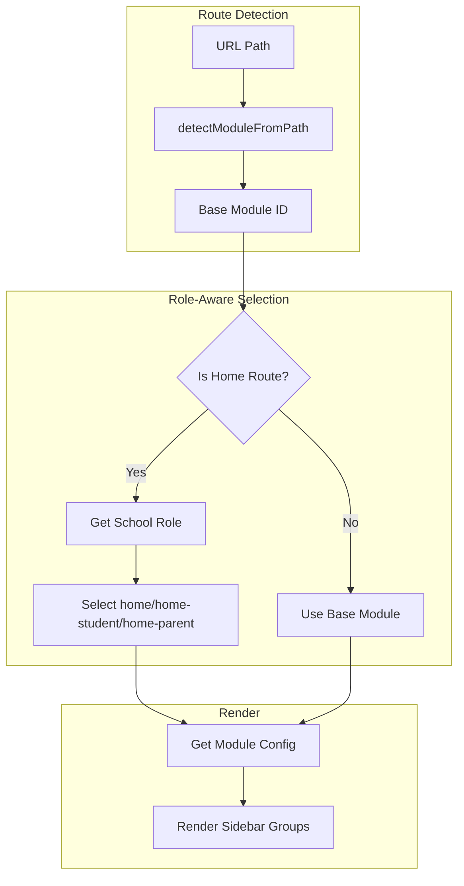
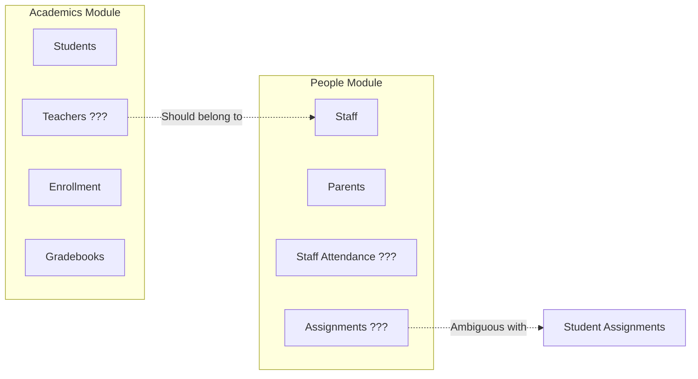

# EdForge Navigation & UX Architecture Expert Review

## Executive Assessment

EdForge has a **strong technical foundation** but exhibits significant gaps between its vision as a "next-generation, evidence-based EMIS with Apple Design philosophy" and its current implementation. The codebase shows sophisticated patterns (ABAC permissions, role-aware navigation, spring animations) but lacks critical enterprise UX patterns that would make it production-ready.---

## Part 1: What Works Well (Preserve These)

### Architecture Strengths

**1. Role-Aware Navigation System**The [`useSidebarModule`](src/hooks/useSidebarModule.ts) hook and [`sidebar-modules.ts`](src/config/sidebar-modules.ts) configuration demonstrate excellent separation of concerns:



**2. ABAC Permission Engine**The [`abac.ts`](src/lib/abac.ts) implementation is comprehensive with:

- Resource-level permissions
- Object-level entity permissions
- React hooks (`usePermission`, `useCanAccess`)
- Communication audience checks

**3. Design System Foundation**The [`index.css`](src/index.css) demonstrates a well-thought-out theming approach with:

- Custom color palette from Coolors (Ink, Teal, Cyan, Aqua, Vanilla, Golden, Caramel, Rust)
- CSS custom properties for light/dark modes
- Glassmorphism utilities
- Brand gradients

**4. Animation System**The [`Sidebar.tsx`](src/components/layout/Sidebar.tsx) shows polished micro-interactions:

- `AnimatedNavIcon` with hover glow effects
- `layoutId` for shared element transitions
- Spring-based width animations

---

## Part 2: Critical Weaknesses & Expert Critiques

### Product Designer Perspective

**Problem 1: Missing Wayfinding**Users navigating deep routes (e.g., `/finance/receivables/tuition`) have no visual indication of their location hierarchy. The "Back to Home" button is insufficient for enterprise workflows.> **Impact:** Users get "lost in module" - especially problematic for infrequent users or training scenarios.**Problem 2: No Global Search with Context**While `CommandPalette` exists, it lacks:

- Recent search history
- Contextual suggestions (e.g., when in Finance, suggest finance-related actions first)
- Keyboard shortcuts for common actions (⌘+N for new student)

**Problem 3: Information Density Issues**The home page [`home.tsx`](src/routes/_protected/home.tsx) uses a widget-based layout but lacks:

- Customizable widget arrangement (drag-and-drop)
- Widget size options (1x1, 2x1, 2x2)
- Data-driven "At-Risk" or "Needs Attention" widgets

### Architect Engineer Perspective

**Problem 4: Route/Module ID Inconsistencies**In [`sidebar-modules.ts`](src/config/sidebar-modules.ts):

```typescript
// Line 153-158: ID mismatch creates confusion
{
  id: 'human-resource',      // <-- ID suggests HR
  label: 'Financials',       // <-- Label says Finance
  icon: HandCoins,
  href: '/finance',          // <-- Route is Finance
}
```

**Problem 5: Duplicated Type Definition**

```typescript
// Line 126-127: Duplicate 'people' in union type
export type SidebarModule =
  | 'people'
  | 'people'  // <-- BUG: Duplicate entry
```

**Problem 6: Missing Error Boundaries**No React error boundaries exist at route or module levels. A crash in one widget takes down the entire page.**Problem 7: No Route Guards for Missing Data**Routes like `/academics/students/$studentId` don't validate the `studentId` exists before rendering - likely producing unclear errors.

### UX Expert Perspective

**Problem 8: Ambiguous Domain Terminology**| Term | Used In | Confusion |

|------|---------|-----------|

| "Teachers" | Academics | Are they people or academic resources? |

| "Assignments" | People | Student homework or staff duties? |

| "Attendance" | Academics + People | Which is which? |

| "Colleague" | People | Too casual for HR directory |**Problem 9: Module Boundary Violations**



**Problem 10: Integrations Placement**In Messages module ([`sidebar-modules.ts`](src/config/sidebar-modules.ts) line 1125-1131):

```typescript
{
  id: 'integrations',
  label: 'Integrations',
  href: '/messages/integrations',  // <-- Wrong location
}
```

Integrations should be a one-time setup in **Settings**, not a recurring navigation item in Messages.**Problem 11: Missing Progressive Disclosure**The "Add New" dropdown in [`Header.tsx`](src/components/layout/Header.tsx) shows ALL options at once. Enterprise apps need:

- Recently used actions pinned
- Role-based filtering (already done - good!)
- Search within dropdown for 10+ options

---

## Part 3: Missing Enterprise Patterns

### 3.1 Breadcrumb Navigation (Priority: HIGH)

```javascript
Home / Finance / Receivables / Tuition / Invoice #INV-2024-001
      ↑         ↑             ↑
   Clickable links for navigation
```

**Implementation:** Create `Breadcrumbs.tsx` using TanStack Router's `useMatches()` to build path-aware crumbs, integrated into [`AppShell.tsx`](src/components/layout/AppShell.tsx).

### 3.2 Quick Switcher / Module Jumper (Priority: HIGH)

Allow direct module-to-module navigation without returning home:

```javascript
[Current: Finance] ──▶ [Quick Switch ⌘J] ──▶ Jump to Academics
```


### 3.3 Decision Support Dashboards (Priority: MEDIUM)

The Analytics module is isolated. Insights should be embedded:

- **Academics Overview:** Show "At-Risk Students" widget
- **Finance Overview:** Show "Overdue Invoices" alert
- **People Overview:** Show "Upcoming Performance Reviews"

### 3.4 Loading & Error States (Priority: HIGH)

Missing patterns across the app:

- Skeleton loaders for data tables
- Route-level error boundaries
- Empty state illustrations
- Optimistic UI updates

### 3.5 Form Patterns (Priority: MEDIUM)

The [`PersonForm.tsx`](src/components/forms/PersonForm.tsx) and related files need:

- Multi-step wizard for complex entities (enrollment)
- Inline validation with debounce
- Auto-save drafts
- Conflict resolution for concurrent edits

### 3.6 Accessibility (Priority: HIGH)

Current gaps:

- Missing `aria-label` on icon-only buttons
- No skip-to-content link
- Focus management on route changes
- Screen reader announcements for dynamic content

---

## Part 4: Recommended Module Restructure

### Current State vs. Proposed State

```mermaid
flowchart TB
    subgraph current [Current Structure - Problems]
        direction TB
        CAcademics[Academics]
        CAcademics --> CStudents[Students]
        CAcademics --> CTeachers[Teachers - Misplaced]
        CAcademics --> CEnrollment[Enrollment]
        
        CPeople[People]
        CPeople --> CStaff[Staff/Colleague]
        CPeople --> CParents[Parents]
        CPeople --> CAssignments[Assignments - Ambiguous]
        CPeople --> CAttendance[Attendance - Duplicated]
        
        CFinance[Finance]
        CFinance --> CPayroll[Payroll - Should be HR]
    end
    
    subgraph proposed [Proposed Structure]
        direction TB
        PAcademics[Academics]
        PAcademics --> PStudents[Students]
        PAcademics --> PEnrollment[Enrollment]
        PAcademics --> PGradebooks[Gradebooks]
        PAcademics --> PStudentAttendance[Student Attendance]
        
        PCommunity["Community (was People)"]
        PCommunity --> PDirectory[Directory]
        PCommunity --> PFaculty[Faculty]
        PCommunity --> PGuardians[Guardians]
        PCommunity --> PDepartments[Departments]
        
        PHR[Human Resources]
        PHR --> PStaffProfiles[Staff Profiles]
        PHR --> PPayroll[Payroll]
        PHR --> PStaffAttendance[Staff Attendance]
        PHR --> PTasks[Tasks - was Assignments]
        PHR --> PPD[Professional Development - NEW]
        
        PFinance[Finance]
        PFinance --> PReceivables[Receivables - Tuition]
        PFinance --> PPayables[Payables - Expenses]
        PFinance --> PLedger[General Ledger]
    end
```



---

## Part 5: Implementation Priorities

### Phase 1: Foundation (Week 1-2)

| ID | Task | Files Affected |

|----|------|----------------|

| `fix-duplicates` | Fix duplicate `people` in SidebarModule type | `sidebar-modules.ts` |

| `fix-id-mismatch` | Change `human-resource` ID to `finance` | `sidebar-modules.ts` |

| `breadcrumbs` | Implement Breadcrumbs component | New: `Breadcrumbs.tsx`, Modify: `AppShell.tsx` |

| `error-boundaries` | Add ErrorBoundary at route level | `_protected.tsx`, New: `ErrorBoundary.tsx` |

### Phase 2: Navigation UX (Week 2-3)

| ID | Task | Files Affected |

|----|------|----------------|

| `quick-switcher` | Module Quick Switcher (⌘J) | Modify: `CommandPalette.tsx`, `Header.tsx` |

| `move-integrations` | Move Integrations to Settings | `sidebar-modules.ts`, Move: `messages/integrations.tsx` |

| `rename-colleague` | Rename "Colleague" to "Directory" | `sidebar-modules.ts` |

| `rename-assignments` | Rename "Assignments" to "Tasks" | `sidebar-modules.ts` |

### Phase 3: Domain Restructure (Week 3-4)

| ID | Task | Files Affected |

|----|------|----------------|

| `move-teachers` | Move Teachers from Academics to People/Community | Multiple route files |

| `split-attendance` | Clarify Student vs Staff Attendance | `academics/attendance.tsx`, `people/attendance.tsx` |

| `hr-module` | Create HR sub-section in People | New routes and sidebar config |

### Phase 4: Polish (Week 4-5)

| ID | Task | Files Affected |

|----|------|----------------|

| `loading-states` | Add skeleton loaders | Component files |

| `empty-states` | Add empty state illustrations | Page components |

| `a11y-audit` | Accessibility improvements | Multiple components |---

## Conclusion

EdForge has excellent architectural bones but needs focused UX improvements to achieve its "Apple Design philosophy" vision. The three highest-impact changes are:

1. **Breadcrumbs** - Immediate wayfinding improvement
2. **Domain boundary cleanup** - Remove confusion between People/Academics/HR
3. **Quick Switcher** - Power user efficiency