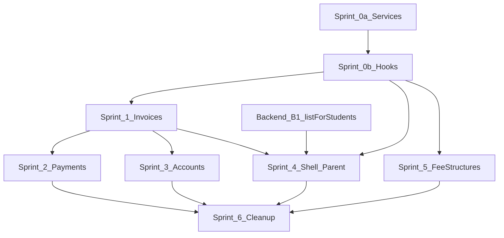

# Finance Table Cursor-Pagination — Sprint Plan

Evidence basis: [invoice pagination investigation](../.cursor/plans/invoice_pagination_investigation_e77b8be7.plan.md) (backend repo). This document breaks the fix into **demoable sprints** of **atomic, committable tasks** with tests or explicit validation.

**Repos involved**

| Repo | Path | Role |
|------|------|------|
| Frontend (primary) | `edforge-saas-frontend/` | MFE tables, hooks, services |
| Backend (coordination) | `edforge/server/application/microservices/finance/` | List APIs already cursor-capable; `listForStudents` gap |

**Reference patterns (copy, do not import across app boundaries)**

- `apps/academics/src/hooks/useStudents.ts` — `useInfiniteQuery` + `flattenStudentPages`
- `apps/shell/src/hooks/usePaginatedQuery.ts` — generic cursor hook (duplicate in `apps/people`)
- `apps/academics/src/components/students/StudentTable.tsx` — `serverPagination` wiring
- `packages/ui/src/components/data-table/DataTablePagination.tsx` — already tested for server mode

**Affected surfaces**

| Surface | Hook / service | Backend endpoint | Default limit |
|---------|----------------|------------------|---------------|
| Invoices list | `useInvoices` → `getInvoices` | `GET …/invoices` | 50 |
| Payments list | `useSchoolPayments` → `getSchoolPayments` | `GET …/payments` | 50 |
| Student accounts list | `useStudentAccounts` → `getStudentAccounts` | `GET …/student-accounts` | 50 |
| Fee structures list | `useFeeStructures` → `getFeeStructures` | `GET …/fee-structures` | 50 |
| Account ledger tab | `useStudentLedger` → `getStudentLedger` | `GET …/student-accounts/:id/ledger` | 50 |
| Account invoices tab | `useInvoices({ studentId })` | `GET …/invoices?studentId=` | 50 |
| Record payment (invoice picker) | `useInvoices({ studentId })` | same | 50 |
| Parent portal (shell) | `useInvoices({ studentId })` | `listForStudents` path | 50 |
| Finance overview KPIs | `useDashboardSummary` | `GET …/dashboard/summary` | full scan (N/A) |

---

## Cross-cutting policies

### Pagination UX

- **Table:** `TanstackDataTable` + `serverPagination` (`hasMore`, `onLoadMore`, `isFetching`).
- **Client page size:** keep existing per-page values (Invoices/Payments/Accounts: 20; Fee structures: 10).
- **Server page size (`limit`):** pass explicitly from hooks (recommend **50** to match backend default on first fetch).
- **Query param name:** send `cursor` (backend decodes via `decodeCursor`); response field is `lastEvaluatedKey`.

### KPI / count policy

| Page type | Money KPIs (totals, rates) | Count tags / table footer |
|-----------|----------------------------|---------------------------|
| Admin list (Invoices, Payments) | **`useDashboardSummary`** — school-wide aggregates | **`totalLoaded` + `+` suffix** when `hasMore`; never imply full total from slice |
| Student-scoped / parent portal | N/A or loaded-only | Loaded count + `+` when `hasMore` |
| Fee structures | Loaded-only (low volume) | Same pattern for consistency |

Do **not** compute collection rate, overdue totals, or “N invoices” admin KPIs from paginated list slices once dashboard is wired.

### Client-side search vs server pagination

`TanstackDataTable` global filter runs on **loaded rows only**. Until server search exists:

- Document in UI: search applies to loaded records.
- Optional follow-up: disable global filter when `hasMore === true` and show hint — defer unless product requires.

### Bulk actions

Bulk issue / row selection operates on **loaded rows only**. Add visible copy when selection is active: e.g. “N selected (loaded records)”.

### Hook migration (non-breaking)

- Services return full **`FinancePaginatedResponse<T>`** including `lastEvaluatedKey`.
- New hooks: **`useInvoicesInfinite`**, etc. — or replace `useInvoices` implementation but expose **`items`**, **`hasMore`**, **`loadMore`**, **`isFetchingNextPage`**, **`totalLoaded`** at top level for shell callers.
- Keep **`Array.isArray(data)`** fallbacks in parent portal until legacy array responses are removed.

### Backend coordination (separate PRs allowed)

| ID | Issue | Blocks |
|----|-------|--------|
| **B-1** | `listForStudents` omits `lastEvaluatedKey`; in-memory merge/slice pagination | Parent portal + student-scoped invoice infinite scroll |
| **B-2** | Frontend sends `{ studentId }` to student-accounts API; controller expects `searchTerm` | Single-account fetch via list endpoint |

Admin-school invoice list uses `InvoicesService.list()` — **not blocked** by B-1.

---

## Sprint 0 — Shared foundation (`packages/finance-services`)

**Sprint goal:** All finance list **services** preserve pagination metadata; shared **hook + helpers** exist with unit tests. No MFE page changes yet — CI green, package publishable.

**Demo:** `npm test` in `packages/finance-services`; manual `getInvoices` mock shows `cursor` forwarded in second call.

### Sprint 0a — Types and service layer

#### FIN-PAG-0.1 — `FinanceListQueryParams` type

**Files:** `packages/finance-services/src/types/pagination.ts` (new), export from `index.ts`

**Work:** Define `{ limit?: number; cursor?: string }`. Extend per-resource filter types (e.g. `InvoiceListParams = InvoiceFilterDto & FinanceListQueryParams`).

**Validation:** Typecheck; no runtime change.

**Commit:** `feat(finance-services): add FinanceListQueryParams type`

---

#### FIN-PAG-0.2 — `normalizeFinanceListResponse<T>()` helper

**Files:** `packages/finance-services/src/utils/normalize-finance-list-response.ts` (new), `__tests__/normalize-finance-list-response.test.ts`

**Work:** Single unwrap for `{ items, hasMore, lastEvaluatedKey? }` vs legacy `T[]`. Preserve all three fields on paginated shape.

**Validation:** Unit tests — paginated object, legacy array, empty/null/undefined.

**Commit:** `feat(finance-services): add normalizeFinanceListResponse helper`

---

#### FIN-PAG-0.3 — Fix `getInvoices` to preserve `lastEvaluatedKey`

**Files:** `packages/finance-services/src/services/invoices.service.ts`

**Work:** Use normalizer; accept `FinanceListQueryParams`; forward `limit` + `cursor` via `apiGet` params.

**Validation:** `__tests__/getInvoices.test.ts` (new) — asserts `lastEvaluatedKey` in return; asserts second call passes `cursor`; legacy array → `hasMore: false`.

**Commit:** `fix(finance-services): preserve lastEvaluatedKey in getInvoices`

---

#### FIN-PAG-0.4 — Fix `getSchoolPayments` paginated return type

**Files:** `packages/finance-services/src/services/payments.service.ts`, `__tests__/getSchoolPayments.test.ts` (new)

**Work:** Change return to `FinancePaginatedResponse<Payment>` (breaking at type level — update only this file + tests in same commit). Use normalizer.

**Validation:** Unit tests mirror getInvoices tests.

**Commit:** `fix(finance-services): return full pagination from getSchoolPayments`

---

#### FIN-PAG-0.5 — Fix `getStudentAccounts` paginated return type

**Files:** `packages/finance-services/src/services/invoices.service.ts`, extend `__tests__/invoices.service.test.ts`

**Work:** Return `FinancePaginatedResponse<StudentAccount>`; preserve `lastEvaluatedKey`. **Do not** pass `{ studentId }` — map to backend-supported params or drop until B-2 (document in code comment).

**Validation:** Update existing tests; add cursor-forwarding test.

**Commit:** `fix(finance-services): preserve pagination in getStudentAccounts`

---

#### FIN-PAG-0.6 — Fix `getStudentLedger` paginated return type

**Files:** `packages/finance-services/src/services/invoices.service.ts`, `__tests__/getStudentLedger.test.ts`

**Work:** Return full `FinancePaginatedResponse<StudentLedgerEntry>`.

**Validation:** Extend existing ledger tests for `lastEvaluatedKey`.

**Commit:** `fix(finance-services): preserve pagination in getStudentLedger`

---

#### FIN-PAG-0.7 — Fix `getFeeStructures` paginated return type

**Files:** `packages/finance-services/src/services/fee-structures.service.ts`, `__tests__/getFeeStructures.test.ts` (new)

**Work:** Accept optional `FinanceListQueryParams`; return full paginated response.

**Validation:** Unit tests.

**Commit:** `fix(finance-services): preserve pagination in getFeeStructures`

---

#### FIN-PAG-0.8 — Align `InvoiceFilterDto` (types package)

**Files:** `packages/types/src/billing.ts`

**Work:** Add `limit?`, `cursor?`; mark `page` / `pageSize` as `@deprecated` with comment pointing to `limit`/`cursor`. Remove or defer `dueDateFrom`/`dueDateTo` if unused by backend.

**Validation:** Typecheck consumers; no behavior change required in this ticket.

**Commit:** `chore(types): align InvoiceFilterDto with backend limit/cursor`

---

### Sprint 0b — Hook layer

#### FIN-PAG-0.9 — `useFinancePaginatedQuery` hook

**Files:** `packages/finance-services/src/hooks/useFinancePaginatedQuery.ts` (new), `__tests__/useFinancePaginatedQuery.test.tsx`

**Work:** Adapt `apps/shell/src/hooks/usePaginatedQuery.ts` into **finance-services** (do not import from shell). Expose: `items`, `hasMore`, `loadMore`, `isLoading`, `isFetchingNextPage`, `totalLoaded`, `error`, `refetch`.

**Validation:** Vitest with mocked `queryFn` — two pages, `getNextPageParam` uses `lastEvaluatedKey`, flattening, filter key change resets pages.

**Commit:** `feat(finance-services): add useFinancePaginatedQuery hook`

---

#### FIN-PAG-0.10 — `flattenFinancePages()` helper

**Files:** `packages/finance-services/src/utils/flatten-finance-pages.ts`, tests

**Work:** Mirror `flattenStudentPages` from academics.

**Validation:** Unit test with two mock pages.

**Commit:** `feat(finance-services): add flattenFinancePages helper`

---

#### FIN-PAG-0.11 — `buildServerPaginationProps()` helper

**Files:** `packages/finance-services/src/utils/build-server-pagination-props.ts`, tests

**Work:** Map hook result → `{ serverPagination, isFetching }` for `TanstackDataTable`.

**Validation:** Unit test — `hasMore: true` produces enabled config object.

**Commit:** `feat(finance-services): add buildServerPaginationProps helper`

---

#### FIN-PAG-0.12 — Temporary shim: keep `useInvoices` as `useQuery` (compat)

**Files:** `packages/finance-services/src/hooks/usePayments.ts`

**Work:** Until Sprint 1 migrates callers, `useInvoices` continues calling `getInvoices` once and returns `{ data: { items, hasMore } }` — add `lastEvaluatedKey` to data shape. Export `useInvoicesInfinite` stub that throws `not implemented` OR skip export until Sprint 1.

**Validation:** Existing callers typecheck; no runtime regression.

**Commit:** `chore(finance-services): expose lastEvaluatedKey on useInvoices data shape`

---

**Sprint 0 demo checklist**

- [ ] `cd packages/finance-services && npm test` — all new tests pass
- [ ] `npm run build` in finance-services
- [ ] No finance MFE route changes required to ship Sprint 0

---

## Sprint 1 — Invoices list (reference implementation)

**Sprint goal:** Admin **Invoices** table loads additional pages on Next; KPI money metrics from dashboard; count tags show loaded+.

**Demo:** Local finance MFE against UAT/prod school with >50 invoices — table footer shows `50+`, Next fetches page 2, row count increases.

### FIN-PAG-1.1 — `useInvoicesInfinite` hook

**Files:** `packages/finance-services/src/hooks/useInvoicesInfinite.ts`, `__tests__/useInvoicesInfinite.test.tsx`, export from `index.ts`

**Work:** Bind `useFinancePaginatedQuery` to `getInvoices` + `paymentKeys.invoiceList(schoolId, filters)`. Default `limit: 50`. Include all filter fields in `queryKey`.

**Validation:** Mock API — two sequential responses; assert `cursor` on second request.

**Commit:** `feat(finance-services): add useInvoicesInfinite hook`

---

### FIN-PAG-1.2 — Wire Invoices page table pagination

**Files:** `apps/finance/src/routes/billing/invoices/index.tsx`

**Work:** Replace `useInvoices` with `useInvoicesInfinite`. Pass flattened `items` to table. Wire `serverPagination` + `isFetching` via helper. Keep `pagination={{ pageSize: 20 }}`.

**Validation:** Manual — >50 invoices, click Next at page boundary triggers load; network tab shows `cursor` query param.

**Commit:** `fix(finance): wire server pagination on invoices list table`

---

### FIN-PAG-1.3 — Invoices page KPI grid uses dashboard summary

**Files:** `apps/finance/src/routes/billing/invoices/index.tsx`

**Work:** Add `useDashboardSummary(schoolId)` for money KPIs (total invoiced, collected, outstanding, overdue, collection rate). Remove `useMemo` reductions over paginated `invoices` for those fields.

**Validation:** Manual — with >50 invoices, KPI amounts match Finance Overview (same school, no date filter).

**Commit:** `fix(finance): source invoice list KPIs from dashboard summary`

---

### FIN-PAG-1.4 — Invoices count tags and table footer labeling

**Files:** `apps/finance/src/routes/billing/invoices/index.tsx`

**Work:** StatCard tags use `` `${totalLoaded}${hasMore ? '+' : ''} invoices` ``. Rely on DataTable footer `+` suffix via `serverPagination` (no `totalCount` override).

**Validation:** RTL or manual — footer text contains `+` when mock returns `hasMore: true`.

**Commit:** `fix(finance): show loaded+ suffix on invoice count tags`

---

### FIN-PAG-1.5 — Filter reset behavior (status chips)

**Files:** `apps/finance/src/routes/billing/invoices/index.tsx`, test in `useInvoicesInfinite.test.tsx`

**Work:** Confirm status filter change updates `queryKey` and clears accumulated pages (TanStack default). Add test with two filter values.

**Validation:** Unit test + manual — switch status chip resets to page 1 with new data.

**Commit:** `test(finance): assert invoice list filter resets pagination`

---

### FIN-PAG-1.6 — Bulk selection disclaimer

**Files:** `apps/finance/src/routes/billing/invoices/index.tsx`

**Work:** When `rowSelection` non-empty and `hasMore`, show helper text near bulk action bar.

**Validation:** Manual — select rows on page 1 with hasMore; disclaimer visible.

**Commit:** `fix(finance): clarify bulk invoice selection is loaded-rows only`

---

### FIN-PAG-1.7 — Mutation invalidation for infinite invoice query

**Files:** `packages/finance-services/src/hooks/usePayments.ts` (issue/cancel/bulk mutations)

**Work:** Verify `invalidateQueries({ queryKey: paymentKeys.invoices(schoolId) })` refetches infinite query from page 0. Add test with QueryClient mock.

**Validation:** Unit test — after invalidate, only one `queryFn` call with no cursor.

**Commit:** `test(finance-services): invoice mutation invalidates infinite query`

---

### FIN-PAG-1.8 — Invoices page component test (optional but recommended)

**Files:** `apps/finance/src/routes/billing/invoices/__tests__/index.pagination.test.tsx` (new)

**Work:** Mock `useInvoicesInfinite`; render table; click Next at end of loaded buffer; assert `loadMore` called.

**Validation:** Vitest + RTL.

**Commit:** `test(finance): invoices list triggers loadMore on table Next`

---

**Sprint 1 demo checklist**

- [ ] School with 675 invoices: overview still 675; list shows 50+ and loads more on Next
- [ ] KPI dollar amounts match overview
- [ ] Status filter resets list
- [ ] Issue/cancel invoice refreshes list from start

---

## Sprint 2 — Payments list

**Sprint goal:** Payments table matches Invoices pagination pattern.

**Demo:** School with >50 payments — Next loads more; KPI money from dashboard where applicable.

### FIN-PAG-2.1 — `useSchoolPaymentsInfinite` hook

**Files:** `packages/finance-services/src/hooks/useSchoolPaymentsInfinite.ts`, tests

**Validation:** Same as FIN-PAG-1.1 for payments endpoint.

**Commit:** `feat(finance-services): add useSchoolPaymentsInfinite hook`

---

### FIN-PAG-2.2 — Update `useSchoolPayments` consumers for paginated service

**Files:** `packages/finance-services/src/hooks/usePayments.ts`

**Work:** Either deprecate `useSchoolPayments` (single page) or reimplement as first-page wrapper. Update return type handling after FIN-PAG-0.4.

**Validation:** Typecheck finance app.

**Commit:** `refactor(finance-services): adapt useSchoolPayments to paginated service`

---

### FIN-PAG-2.3 — Wire Payments page table + server pagination

**Files:** `apps/finance/src/routes/billing/payments/index.tsx`

**Work:** Same pattern as FIN-PAG-1.2–1.4. Dashboard for money KPIs; loaded+ for counts.

**Validation:** Manual + optional RTL test.

**Commit:** `fix(finance): wire server pagination on payments list`

---

### FIN-PAG-2.4 — Payments filter reset tests

**Files:** hook tests for status/gateway filter key changes

**Validation:** Unit tests.

**Commit:** `test(finance-services): payments filter resets pagination`

---

### FIN-PAG-2.5 — Payments mutation invalidation test

**Files:** void/refund mutation hooks

**Validation:** QueryClient test.

**Commit:** `test(finance-services): payment mutations invalidate infinite query`

---

**Sprint 2 demo checklist**

- [ ] >50 payments load on Next
- [ ] Void/refund refreshes list

---

## Sprint 3 — Student accounts list + detail tabs

**Sprint goal:** Accounts table paginates; expanded **Ledger** and **Invoices** tabs paginate (student-scoped).

**Demo:** School with >50 accounts; expand one account — ledger and invoices tabs load more if needed.

### FIN-PAG-3.1 — `useStudentAccountsInfinite` hook

**Files:** new hook + tests

**Commit:** `feat(finance-services): add useStudentAccountsInfinite hook`

---

### FIN-PAG-3.2 — Wire Student Accounts main table

**Files:** `apps/finance/src/routes/billing/accounts/index.tsx`

**Work:** Replace `useStudentAccounts`; server pagination on main `TanstackDataTable`.

**Validation:** Manual >50 accounts.

**Commit:** `fix(finance): wire server pagination on student accounts list`

---

### FIN-PAG-3.3 — `useStudentLedgerInfinite` hook

**Files:** new hook + tests

**Commit:** `feat(finance-services): add useStudentLedgerInfinite hook`

---

### FIN-PAG-3.4 — Ledger tab pagination UI

**Files:** `apps/finance/src/routes/billing/accounts/index.tsx` (`LedgerTab`)

**Work:** Replace plain table with paginated fetch + “Load more” or small paginated table. (Ledger tab may use simpler “Load more” button if full DataTable is heavy — product choice; minimum is cursor continuation.)

**Validation:** Manual account with >50 ledger entries.

**Commit:** `fix(finance): paginate student account ledger tab`

---

### FIN-PAG-3.5 — Student-scoped `useInvoicesInfinite` in Invoices tab

**Files:** `InvoicesTab` in accounts/index.tsx

**Work:** Use `useInvoicesInfinite(schoolId, { studentId })` + flatten. Wire load-more for tab table.

**Validation:** Manual — student with >50 invoices (rare; mock in dev).

**Commit:** `fix(finance): paginate student invoices tab in accounts`

---

### FIN-PAG-3.6 — Fix student-accounts API param mapping (B-2)

**Files:** `getStudentAccounts` service; coordinate with backend if adding `studentId` query is preferred

**Work:** Stop sending ignored `studentId`; use `searchTerm` or dedicated GET by account id.

**Validation:** Unit test asserts correct query params.

**Commit:** `fix(finance-services): correct student-accounts list query params`

---

**Sprint 3 demo checklist**

- [ ] Accounts list loads beyond 50
- [ ] Expanded ledger tab loads beyond 50
- [ ] Expanded invoices tab uses cursor when available

---

## Sprint 4 — Shell parent portal + record payment

**Sprint goal:** Parent/student-facing invoice lists handle pagination; record-payment invoice picker loads all payable invoices for a student.

**Demo:** Parent portal fee payment page with many invoices; record payment form shows full student invoice list.

**Blocked partially by B-1** until backend `listForStudents` returns proper cursor — see Sprint 4.0.

### FIN-PAG-4.0 — Backend: fix `listForStudents` pagination (B-1)

**Files:** `server/application/microservices/finance/src/invoices/invoices.service.ts` (`listForStudents`)

**Work:** Return `lastEvaluatedKey`; define correct multi-student cursor strategy (may require composite cursor or per-student iteration with documented semantics).

**Validation:** NestJS unit/integration test — two pages for Parent role with one linked student.

**Commit (backend repo):** `fix(finance): return cursor from listForStudents`

---

### FIN-PAG-4.1 — Migrate `useInvoices` to infinite implementation

**Files:** `packages/finance-services/src/hooks/usePayments.ts`

**Work:** Replace internals with `useInvoicesInfinite`; expose flat `{ items, isLoading, hasMore, loadMore, ... }` for backward compat OR migrate all callers in this sprint.

**Validation:** All grep callers compile and behave.

**Commit:** `feat(finance-services): make useInvoices cursor-aware`

---

### FIN-PAG-4.2 — Parent portal FeePaymentPage

**Files:** `apps/shell/src/pages/parent-portal/FeePaymentPage.tsx`

**Work:** Consume `loadMore` / `hasMore`; UI for loading more invoices (button or infinite scroll).

**Validation:** Manual parent login with student >50 invoices (post B-1).

**Commit:** `fix(shell): paginate parent fee payment invoice list`

---

### FIN-PAG-4.3 — Parent portal ParentOverviewPage

**Files:** `apps/shell/src/pages/parent-portal/ParentOverviewPage.tsx`

**Work:** Same as 4.2 for invoice summary list.

**Validation:** Manual.

**Commit:** `fix(shell): paginate parent overview invoice list`

---

### FIN-PAG-4.4 — Record manual payment invoice picker

**Files:** `apps/finance/src/routes/billing/payments/record.tsx`

**Work:** Use paginated hook; ensure dropdown/list shows all unpaid invoices for student (load-more in select or prefetch all pages on mount — document choice).

**Validation:** Manual — student with >50 open invoices can select one not on first page.

**Commit:** `fix(finance): paginate invoice picker on record payment`

---

**Sprint 4 demo checklist**

- [ ] Backend B-1 deployed to UAT
- [ ] Parent portal loads invoice page 2
- [ ] Record payment can select invoice from page 2+

---

## Sprint 5 — Fee structures list

**Sprint goal:** Fee structures table supports cursor pagination (consistency; low volume but same bug class).

**Demo:** If >50 fee structures exist, table loads more.

### FIN-PAG-5.1 — `useFeeStructuresInfinite` hook

**Files:** `packages/finance-services/src/hooks/useFeeStructures.ts`, tests

**Commit:** `feat(finance-services): add useFeeStructuresInfinite hook`

---

### FIN-PAG-5.2 — Wire FeeStructureList component

**Files:** `apps/finance/src/components/configuration/FeeStructureList.tsx`, `routes/configuration/fee-structures.tsx`

**Work:** server pagination; pageSize 10 unchanged.

**Validation:** Manual or RTL.

**Commit:** `fix(finance): wire server pagination on fee structures list`

---

**Sprint 5 demo checklist**

- [ ] Fee structures list uses cursor when hasMore (test with lowered limit mock)

---

## Sprint 6 — Cleanup, docs, regression

**Sprint goal:** Remove deprecated paths; document behavior; full regression pass.

### FIN-PAG-6.1 — Remove deprecated `useInvoices` single-page code path

**Files:** finance-services hooks

**Validation:** No remaining `useQuery` invoice list except detail `useInvoice(id)`.

**Commit:** `refactor(finance-services): remove single-page useInvoices`

---

### FIN-PAG-6.2 — Remove `page`/`pageSize` from active DTO usage

**Files:** `packages/types/src/billing.ts`, grep cleanup

**Commit:** `chore(types): remove deprecated page/pageSize from invoice filters`

---

### FIN-PAG-6.3 — Manual smoke test checklist (deploy evidence)

**Files:** `docs/deploys/` or `docs/finance-pagination-smoke.md`

**Work:** Step-by-step UAT script for all six surfaces + parent portal.

**Validation:** Checklist executed and logged per repo deploy convention.

**Commit:** `docs(finance): add pagination smoke test checklist`

---

### FIN-PAG-6.4 — Optional E2E (if Playwright/Cypress exists for finance)

**Files:** e2e suite

**Work:** One test — mock or seed >50 invoices, assert Next enables and row count increases.

**Validation:** CI green.

**Commit:** `test(e2e): finance invoices table server pagination`

---

### FIN-PAG-6.5 — Overview vs list filter alignment note

**Files:** ADR or comment in overview hook

**Work:** Document that invoice list status filter ≠ dashboard status breakdown unless backend extended.

**Commit:** `docs(finance): document dashboard vs list filter scope`

---

**Sprint 6 demo checklist**

- [ ] Full UAT smoke script signed off
- [ ] No finance list table capped at 50 without load-more path

---

## Task dependency graph

---

## Subagent review — incorporated changes

Review agent: `1b8c8915-c2a3-423e-9843-08a5258d1218`

| Recommendation | Action taken |
|----------------|--------------|
| Sprint 0 must fix all list services, not only invoices | FIN-PAG-0.3–0.7 |
| Hook lives in finance-services, not shell import | FIN-PAG-0.9 |
| Merge accounts + detail tabs | Sprint 3 combined |
| Shell parent portal sprint | Sprint 4 |
| KPIs from dashboard on admin lists | FIN-PAG-1.3 |
| Backend B-1 before parent portal | FIN-PAG-4.0 |
| B-2 studentId vs searchTerm | FIN-PAG-3.6 |
| Non-breaking service migration | Sprint 0 + shim FIN-PAG-0.12 |
| Client search / bulk selection documented | Cross-cutting + FIN-PAG-1.6 |
| Fee structures deferred after accounts | Sprint 5 after 3–4 |

---

## Ticket index (quick reference)

| ID | Sprint | Summary |
|----|--------|---------|
| FIN-PAG-0.1 | 0a | FinanceListQueryParams type |
| FIN-PAG-0.2 | 0a | normalizeFinanceListResponse |
| FIN-PAG-0.3 | 0a | getInvoices preserves cursor |
| FIN-PAG-0.4 | 0a | getSchoolPayments paginated |
| FIN-PAG-0.5 | 0a | getStudentAccounts paginated |
| FIN-PAG-0.6 | 0a | getStudentLedger paginated |
| FIN-PAG-0.7 | 0a | getFeeStructures paginated |
| FIN-PAG-0.8 | 0a | InvoiceFilterDto align |
| FIN-PAG-0.9 | 0b | useFinancePaginatedQuery |
| FIN-PAG-0.10 | 0b | flattenFinancePages |
| FIN-PAG-0.11 | 0b | buildServerPaginationProps |
| FIN-PAG-0.12 | 0b | useInvoices compat shim |
| FIN-PAG-1.1–1.8 | 1 | Invoices list end-to-end |
| FIN-PAG-2.1–2.5 | 2 | Payments list |
| FIN-PAG-3.1–3.6 | 3 | Accounts + tabs |
| FIN-PAG-4.0 | 4 | Backend listForStudents |
| FIN-PAG-4.1–4.4 | 4 | Shell + record payment |
| FIN-PAG-5.1–5.2 | 5 | Fee structures |
| FIN-PAG-6.1–6.5 | 6 | Cleanup + docs + E2E |

---

## Out of scope (explicit deferrals)

- Server-side text search on invoice/payment lists
- `total` count field on list API responses
- Dashboard summary filtered by invoice status chip (needs backend)
- Extract `@edforge/query` shared package from shell/people/finance hooks
- CSV export pagination (already multi-page on backend)
