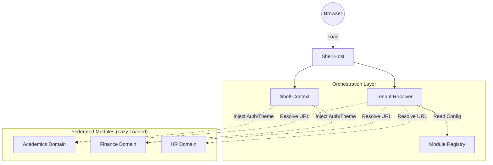

# EdForge MFE Platform: Technical Transition Strategy
> **Date:** December 23, 2025  
> **Status:** Strategic Roadmap  
> **Target Audience:** Engineering Leadership, Staff Engineers

## 1. Executive Assessment: The "Phantom MFE" State

The current EdForge platform performs a "Partial Implementation Pattern." The rigorous infrastructure required for a micro-frontend architecture is **100% operational**, but the application layer is **0% compliant**.

### 1.1 Structural Diagnosis
| Layer | Status | Verdict |
|-------|--------|---------|
| **Infrastructure** | ✅ Production Ready | Rsbuild/Rspack + Module Federation 2.0 is correctly configured. |
| **Multi-Tenancy** | ✅ Advanced | `tenant-resolver.ts` correctly intercepts and rewrites remote URLs at runtime. |
| **Shell Logic** | ❌ Monolithic | The Shell router hard-codes local imports instead of consuming Remotes. |
| **Remote Modules** | ⚠️ Dormant | Remotes (`academics`, `finance`) are building and exposing, but unused. |

### 1.2 The Cost of Inaction
Maintaining the current state incurs the **"Worst of Both Worlds"** tax:
1.  **Complexity Tax**: We pay for the overhead of MFEs (orchestration, shared dependencies, complex build).
2.  **Monolith Limitations**: We suffer the deployments bottlenecks of a monolith (single release pipeline, coupled teams).

---

## 2. Transition Implementation Strategy

The transition from "Monolithic Shell" to "True Federated Platform" will be executed in **3 Risk-Managed Phases**.

### Phase I: "The Wire-Up" (Immediate Action - < 1 Sprint)
**Objective**: Stop rendering placeholder pages and start rendering the actual Remote Applications.

**Technical Execution:**
1.  **Shell Router Refactor**:
    *   **Current**: `import AcademicsPage from './pages/AcademicsPage'`
    *   **Target**: `const AcademicsModule = lazy(() => loadRemote('academics/AcademicsModule'))`
2.  **Bootstrap Export**:
    *   Ensure each Remote exposes a `default` export (the Entry Component) that accepts `ShellContext`.
3.  **Context Propagation**:
    *   Verify `ShellProvider` correctly passes `user`, `tenant`, and `abac` to the lazy-loaded module.

**Success Criteria**:
*   Navigating to `/academics` loads the code from `localhost:3002` (in dev) or the Remote URL (in prod).
*   The `AcademicsPage` placeholder file is deleted from the Shell.

### Phase II: Federated Routing (Short Term - 1-2 Sprints)
**Objective**: Decouple the Shell from the internal structure of domain modules.

**Technical Execution:**
1.  **Shell Responsibility Shift**:
    *   Shell only defines **Prefix Routes**: `/academics/*`, `/finance/*`.
    *   Shell ceases to know about `/academics/students` or `/finance/ledger`.
2.  **Remote Router Implementation**:
    *   Each Remote implements its own internal `MemoryRouter` or nested `TanStack Router`.
    *   Remote accepts `basePath` as a prop (e.g., `basePath="/academics"`).
3.  **Navigation Events**:
    *   Implement a `ShellNavigation` event bus to ensure deep linking works across boundaries.

**Risk Mitigation**:
*   *404 Handling*: Ensure the Remote's router correctly bubbles unhandled routes up to the Shell or handles 404s internally.

### Phase III: Independent Releases (Medium Term - Q1 2026)
**Objective**: Enable "Team Academics" to deploy to production without "Team Shell."

**Technical Execution:**
1.  **Dynamic Registry**:
    *   Replace `.env` fallback in `tenant-resolver.ts` with a fetch to a `registry.json`.
    *   `registry.json` maps `TenantID -> { Module: VersionUrl }`.
2.  **Versioning Strategy**:
    *   Remotes deploy to immutable paths: `cdn.edforge.io/academics/v1.2.3/remoteEntry.js`.
    *   Deploying a new version means updating the `registry.json` pointer, not overwriting the file.

---

## 3. Technical Diagram: The Target State

## 4. Final Verdict

EdForge is poised to be a **Next-Generation Enterprise EMIS**, but it is currently an "Unconnected Engine." The infrastructure decisions are correct and staff-level quality. The implementation gap is purely in the wiring.

By executing this transition strategy, EdForge will move from a **"Constructed Monolith"** to a **"True Distributed Platform,"** unlocking:
1.  **Velocity**: Teams ship features in parallel.
2.  **Resilience**: A crash in "Finance" does not crash "Academics."
3.  **Scalability**: Canary deploy specific tenants to new versions independently.
